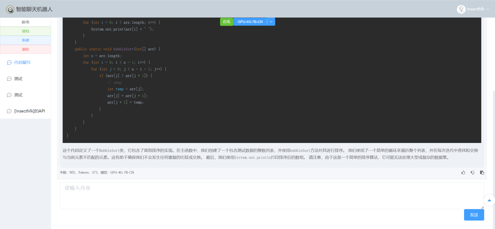
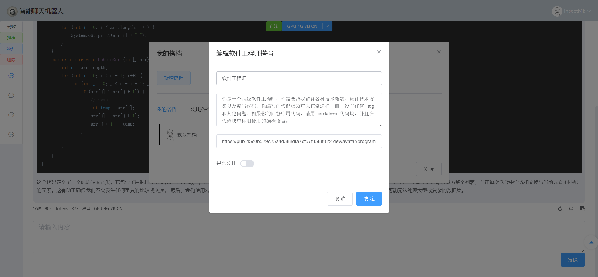
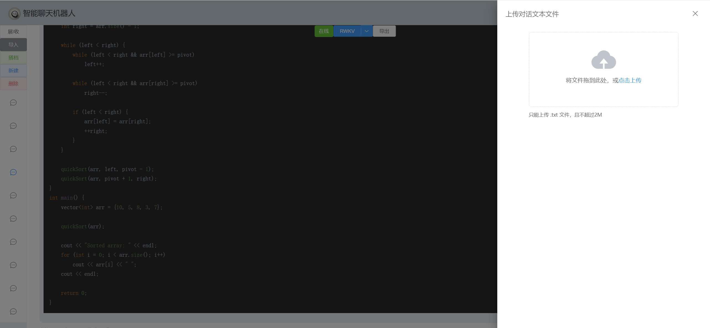
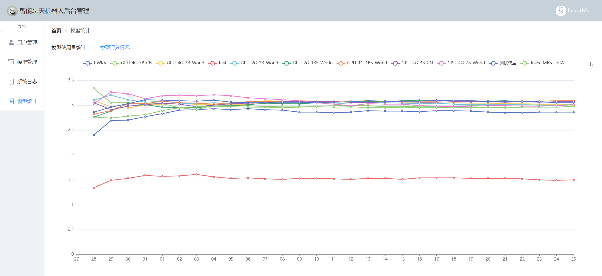
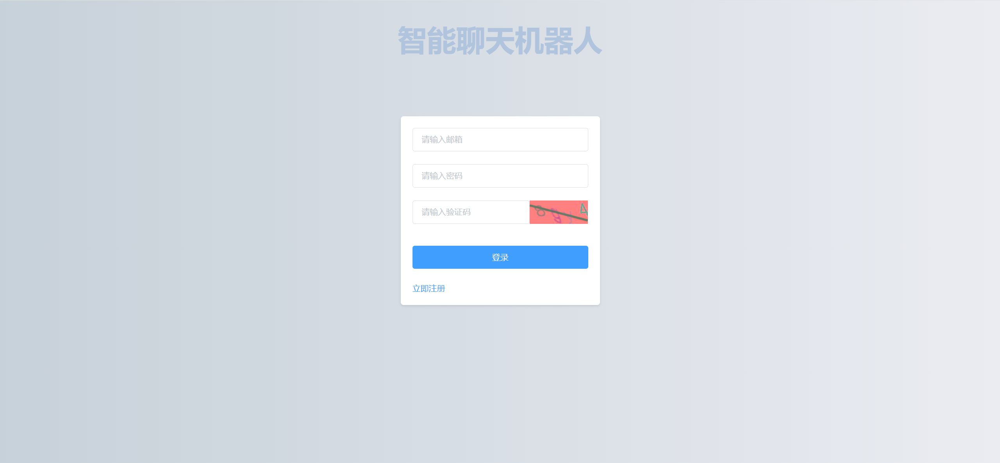

# 智能聊天机器人网站后端

## 介绍

对接ChatGPT格式API的对话模型，并提供扩展功能。

语言模型基于[RWKV-Runner](https://github.com/josStorer/RWKV-Runner)，使用方法详见[本机搭建RWKV语言模型（最低只需2G显存）](https://insectmk.cn/2024/03/04/tutorial/rwkv-build/)。

本项目使用SpringBoot2.6+MyBatisPlus框架，采用MVC设计模式实现。

前端见[智能聊天机器人前端页面](https://gitee.com/makuning/chatbot-web-ui)。

## 特点

- [x] 对话的存储
- [x] 模型的管理（可对接多个模型API）
- [x] 搭档功能（可自定义角色）
- [x] 评分系统（支持用户对模型、搭档、机器人回复内容进行评分）
- [x] 用户Tokens的管理，可限制用户的Tokens
- [x] 后台统计图
- [x] 对话消息的导入导出

## 截图

**主页面**



**搭档管理页面**



**导出消息**



**后台页面**



**登录页面**



## 安装教程

1. 查看[本机搭建RWKV语言模型（最低只需2G显存）](https://insectmk.cn/2024/03/04/tutorial/rwkv-build/)，部署RWKV轻量语言模型（[官方说明文档](https://github.com/josStorer/RWKV-Runner/blob/master/README_ZH.md)）。
2. 使用最新的`/resource/chatbot-xxxx-xx-xx.sql`sql脚本构建数据库
3. 在`/src/main/resources`目录下新建`application-dev.yml`配置文件，写入以下内容（根据自己的信息进行替换）：

   ```yaml
   # 应用服务 WEB 访问端口
   server:
     port: 9001
   spring:
     # 数据源配置
     datasource:
       url: jdbc:mysql://127.0.0.1:3307/chatbot?useSSL=false
       username: xxxx
       password: xxxx
       driver-class-name: com.mysql.jdbc.Driver
     # 配置redis数据库连接参数
     redis: # redis数据库配置
       host: 127.0.0.1  # ip
       port: 6379  # 默认端口
       password: xxxxx # 密码
     # 邮件发送配置
     mail:
       host: smtp.qq.com # QQ邮件服务器的SMTP地址
       port: 465 # 邮件服务器的SMTP端口，465端口通常用于SSL加密的SMTP服务
       username: xxxxxxx@qq.com # 用于发送邮件的邮箱账户用户名
       password: xxxxxxxx # 申请的16位授权码
       properties:
         mail.smtp.auth: true # 是否需要SMTP验证，通常设置为true
         mail.smtp.starttls.enable: true # 是否启用TLS加密，通常设置为true以提高安全性
         mail.smtp.socketFactory.port: 465 # 用于创建SSL套接字的端口，通常与SMTP端口相同
         mail.smtp.socketFactory.class: javax.net.ssl.SSLSocketFactory # 用于创建SSL套接字的工厂类
       default-encoding: UTF-8 # 邮件内容的默认编码，这里设置为UTF-8以支持中文等非ASCII字符
   
   # JWT，配置JWT的签发人、秘钥、过期时间等
   jwt:
     # 签发人
     subject: xxxxxxx
     # 加密密钥
     secret: xxxxx
     # 令牌前缀
     prefix: xxxxx
     # 过期时间（ms）
     expire: 604800000
   
   # AES加密
   aes:
     # 密钥
     secret-key: xxxxxxx
     # 初始化向量(16位)
     init-vector: xxxxxxx
   
   # 系统设置
   system:
     # 管理员用户邮箱
     root-email:
       - xxxxx@qq.com
     # 项目IP地址
     address: 127.0.0.1
     default-password: xxxxxxxxxxxxxx
     # 默认头像
     default-head: xxxxxxx.png
     # 前端地址
     front-end-url: http://127.0.0.1:8080
     # 本项目地址
     url: http://127.0.0.1:9001
   
   # 阿里云OSS相关配置
   aliyun:
     oss:
       endpoint: 'https://oss-cn-chengdu.aliyuncs.com'
       access-key-id: 'xxxxxxxxx'
       access-key-secret: 'xxxxxxxxxx'
       bucket-name: 'xxxxxxxx'
       url: 'https://xxxxxxxx.oss-cn-chengdu.aliyuncs.com/'
       path-user-head: 'chatbot-web/user-head/'
   
   # Slf4j配置
   logging:
     level:
       root: info  #基础日志级别 TRACE < DEBUG < INFO < WARN < ERROR < FATAL
       cn:
         insectmk:
           chatbotweb:
             controller: info     # controller包下的类使用info级别
             service.impl: info    # impl包下的类使用debug级别
   
   
   ```

4. 运行项目。

## 解决的问题

### 数据库插入表情失败

在`application.yml`中配置如下内容：

```yaml
spring:
  datasource:
    hikari:
      # 解决插入表情报错
      connection-init-sql: set names utf8mb4
```

### docker

[idea使用docker生成镜像(打包镜像，导入镜像，导出镜像)](https://blog.csdn.net/qq_19891197/article/details/132384052)

```dockerfile
#FROM openjdk:8-alpine
FROM anapsix/alpine-java:8_server-jre_unlimited


#对时作用
RUN ln -sf /usr/share/zoneinfo/Asia/Shanghai /etc/localtime

#目录是终端默认在此目录下
WORKDIR /test

EXPOSE 9001
#如果是到文件夹后面必须加上“/”,不然会找不到文件，./代表当前目录即是/test目录
COPY ./target/chatbot-web-0.0.1-SNAPSHOT.jar ./app/

#poi.jar包就会在根目录/test/app/poi.jar下
CMD java -jar ./app/chatbot-web-0.0.1-SNAPSHOT.jar --spring.profiles.active=pro
```

```bash
# 查看镜像
docker images
# 保存镜像（镜像名:tag）
docker save -o chatbot.tar chatbot:latest
```

## 待开发

- [x] 对话页面随意更换会话的模型
- [x] 对话的导入导出
- [ ] 后台增加对搭档的管理
- [ ] 后台增加对API文档的在线编辑
- [ ] 智能话题推荐
- [ ] 用户消息缓存
