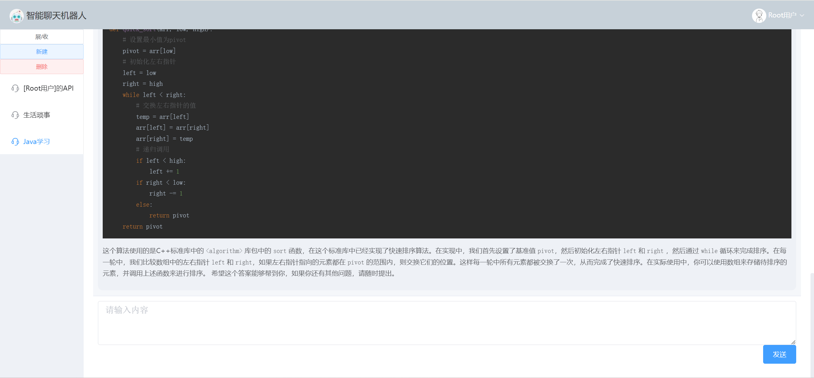
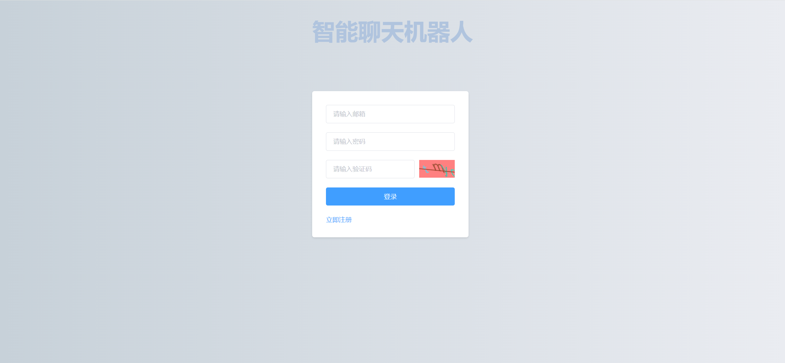

# 智能聊天机器人网站后端

## 介绍

语言模型基于[RWKV-Runner](https://github.com/josStorer/RWKV-Runner)，使用方法详见[本机搭建RWKV语言模型（最低只需2G显存）](https://insectmk.cn/2024/03/04/tutorial/rwkv-build/)。

本项目使用SpringBoot2.6+MyBatisPlus框架，采用MVC设计模式实现。

前端见[智能聊天机器人前端页面](https://gitee.com/makuning/chatbot-web-ui)。

## 项目演示

**主页面**



**登录页面**



## 安装教程

1. 查看[本机搭建RWKV语言模型（最低只需2G显存）](https://insectmk.cn/2024/03/04/tutorial/rwkv-build/)，部署RWKV轻量语言模型。
2. 使用最新的`/resource/chatbot-xxxx-xx-xx.sql`sql脚本构建数据库
3. 在`/src/main/resources`目录下新建`application-dev.yml`配置文件，写入以下内容（根据自己的信息进行替换）：

   ```yaml
   spring:
     # 数据源配置
     datasource:
       url: jdbc:mysql://127.0.0.1:3307/chatbot?useSSL=false
       username: xxxxxxx
       password: xxxxxxx
       driver-class-name: com.mysql.jdbc.Driver
     # 邮件发送配置
     mail:
       host: smtp.qq.com # QQ邮件服务器的SMTP地址
       port: 465 # 邮件服务器的SMTP端口，465端口通常用于SSL加密的SMTP服务
       username: xxxxxxx@qq.com # 用于发送邮件的邮箱账户用户名
       password: kvsulpnwofbadfie # 申请的16位授权码
       properties:
         mail.smtp.auth: true # 是否需要SMTP验证，通常设置为true
         mail.smtp.starttls.enable: true # 是否启用TLS加密，通常设置为true以提高安全性
         mail.smtp.socketFactory.port: 465 # 用于创建SSL套接字的端口，通常与SMTP端口相同
         mail.smtp.socketFactory.class: javax.net.ssl.SSLSocketFactory # 用于创建SSL套接字的工厂类
       default-encoding: UTF-8 # 邮件内容的默认编码，这里设置为UTF-8以支持中文等非ASCII字符
   
   # JWT，配置JWT的签发人、秘钥、过期时间等
   jwt:
     # 签发人
     subject: xxxxxxx
     # 加密密钥
     secret: xxxxxxx
     # 令牌前缀
     prefix: xxxxxxx
     # 过期时间（ms）
     expire: xxxxxxx
   
   # AES加密
   aes:
     key: xxxxxxx
   
   # openAI格式API
   openai:
     api-host: http://127.0.0.1:8000/
     api-key: ""
     max-token: 1024
   
   # 系统设置
   system:
     root-email:
       - xxxxxxx@qq.com
   
   ```

4. 运行项目。

## 使用的第三方包

```xml
<dependency><!-- 用于访问OpenAI格式的API -->
    <groupId>com.github.plexpt</groupId>
    <artifactId>chatgpt</artifactId>
    <version>4.0.7</version>
</dependency>

<dependency><!-- 图形验证码 -->
    <groupId>cn.hutool</groupId>
    <artifactId>hutool-all</artifactId>
    <version>5.8.16</version>
</dependency>

<dependency><!--跨域身份验证解决⽅案 Json web token-->
    <groupId>io.jsonwebtoken</groupId>
    <artifactId>jjwt</artifactId>
    <version>0.7.0</version>
</dependency>

<dependency><!-- 发送WebSocket请求 -->
    <groupId>org.java-websocket</groupId>
    <artifactId>Java-WebSocket</artifactId>
    <version>1.5.1</version>
</dependency>

<dependency><!-- 发送HTTP请求 -->
    <groupId>commons-httpclient</groupId>
    <artifactId>commons-httpclient</artifactId>
    <version>3.1</version>
</dependency>

<dependency><!--发送邮件-->
    <groupId>org.springframework.boot</groupId>
    <artifactId>spring-boot-starter-mail</artifactId>
</dependency>

<dependency><!--boot整合mybatis所需要的包-->
    <groupId>org.mybatis.spring.boot</groupId>
    <artifactId>mybatis-spring-boot-starter</artifactId>
    <version>2.2.2</version>
</dependency>

<dependency><!-- mysql  驱动-->
    <groupId>mysql</groupId>
    <artifactId>mysql-connector-java</artifactId>
    <version>5.1.26</version>
</dependency>

<dependency><!--mybatisplus起步依赖-->
    <groupId>com.baomidou</groupId>
    <artifactId>mybatis-plus-boot-starter</artifactId>
    <version>3.4.0</version>
</dependency>

<dependency><!-- lombok  ,自动生成get,Set 方法-->
    <groupId>org.projectlombok</groupId>
    <artifactId>lombok</artifactId>
    <optional>true</optional>
</dependency>
```


## 解决的问题

### 数据库插入表情失败

在`application.yml`中配置如下内容：

```yaml
spring:
  datasource:
    hikari:
      # 解决插入表情报错
      connection-init-sql: set names utf8mb4
```
