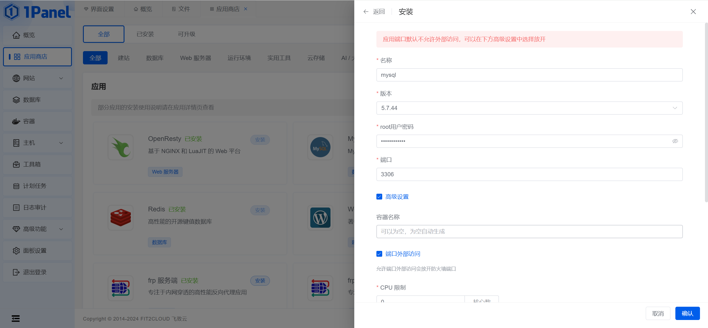

## 开发环境基础软件

JDK:1.8：[https://www.oracle.com/java/technologies/javase/javase8-archive-downloads.html](https://www.oracle.com/java/technologies/javase/javase8-archive-downloads.html)

Maven:3.6.3：[https://archive.apache.org/dist/maven/maven-3/3.6.3/binaries/apache-maven-3.6.3-bin.zip](https://archive.apache.org/dist/maven/maven-3/3.6.3/binaries/apache-maven-3.6.3-bin.zip)

MySQL:5.7：[https://dev.mysql.com/downloads/windows/installer/5.7.html](https://dev.mysql.com/downloads/windows/installer/5.7.html)

Node:20.13.1：[https://nodejs.cn/en/download](https://nodejs.cn/en/download)

Redis:win-3.2.100：[https://github.com/MicrosoftArchive/redis/releases](https://github.com/MicrosoftArchive/redis/releases)

RWKV-Runner：[https://github.com/josStorer/RWKV-Runner/releases](https://github.com/josStorer/RWKV-Runner/releases)

## 开发环境配置

**以下为配置基于个人开发设备，具体最低要求未知。**

| 硬件平台 | 规格                                                         |
| :------- | :----------------------------------------------------------- |
| 设备类型 | 联想 Y7000P 2022                                             |
| 处理器   | 12th Gen Intel(R) Core(TM) i7-12700H   2.30 GHz              |
| 内存     | 32G（建议不低于16G，主要消耗在RWKV模型微调，不微调8G足够）   |
| 存储     | 512G SSD（各环境与项目本身磁盘占用大概10GB）                 |
| 显卡     | NVIDIA GeForce RTX 3050 Ti Laptop GPU （显存2G及以上即可运行RWKV模型） |

| 软件平台   | 版本                                      |
| :--------- | :---------------------------------------- |
| 操作系统   | Windows 11 家庭版或专业版                 |
| 数据库     | MySQL 5.7.44、Redis win-3.2.100           |
| Node.js    | 20.13.1                                   |
| Java框架   | Spring Boot 2.X（内置Tomcat）             |
| IDE        | IntelliJ IDEA 2024.1.1、WebStorm 2024.1.2 |
| 数据库工具 | Navicat 16.1.9、Power Designer 16.5       |
| 浏览器     | Google Chrome 125.0.6422.114              |
| 版本控制   | Git 2.45.2                                |

## 运行环境配置

服务器只负责部署前后端程序，RWKV模型部署在本地机器并使用frp内网穿透技术提供外网访问功能。

| 硬件平台     | 规格                              |
| :----------- | :-------------------------------- |
| 云服务提供商 | 腾讯云                            |
| 服务器类型   | 轻量级服务器                      |
| CPU核心数    | 4核（1核足够）                    |
| 内存         | 4G（不少于1G）                    |
| 存储         | 50G SSD（前后端程序占用80MB左右） |
| GPU          | 无                                |
| 带宽         | 5Mbps                             |
| 流量         | 500G/月                           |

| 软件平台  | 版本                          |
| :-------- | :---------------------------- |
| 操作系统  | Ubuntu Server 20.04 LTS 64bit |
| 数据库    | MySQL 5.7.24                  |
| Node.js   | 20.13.1                       |
| Java框架  | Spring Boot 2.X（内置Tomcat） |
| Web服务器 | OpenResty 1.21.4.3            |
| 管理面板  | 1Panel面板                    |

## 软件安装与系统运行

### 前言

1. 由于RWKV模型运行比较耗费计算机性能，推荐将RWKV模型运行在本机，然后使用frp将RWKV服务内网穿透到公网上。云服务器只需要部署前端以及后端程序即可。
2. 为了方便部署与管理，服务器使用1Panel面板进行管理。
3. 安装软件需要开发对应端口，服务商安全组和服务器防火墙都需要开放。
4. 前后端程序需要在开发环境编译打包后再上传到服务器。

### 环境搭建

#### 1Panel面板

可以参考[1Panel在线安装](https://1panel.cn/docs/installation/online_installation/)。

执行以下脚本安装1panel面板。

```bash
curl -sSL https://resource.fit2cloud.com/1panel/package/quick_start.sh -o quick_start.sh && sudo bash quick_start.sh
```


#### JDK1.8

到[JDK1.8下载页](https://www.oracle.com/java/technologies/javase/javase8-archive-downloads.html)下载`jdk-8u202-linux-x64.tar.gz`，或直接点击[jdk-8u202-linux-x64.tar.gz](https://download.oracle.com/otn/java/jdk/8u202-b08/1961070e4c9b4e26a04e7f5a083f551e/jdk-8u202-linux-x64.tar.gz)进行下载。

将`jdk-8u202-linux-x64.tar.gz`压缩包使用1Panel上传到`/opt/java/`目录下


将`jdk-8u202-linux-x64.tar.gz`解压到当前目录

#### MySQL5.7

到1Panel应用商店安装**MySQL5.7**，可以勾选**端口外部访问**



#### Redis7.2.5

同**MySQL5.7**安装方式

#### OpenResty

同**MySQL5.7**安装方式

#### frps

可以参考[1Panel面板搭建Frp实现内网穿透详细配置](https://cloud.tencent.com/developer/article/2395275)。

到1Panel应用商店安装**frp 服务端**


安装完成后需要**修改frp服务端配置**，进入到frp服务端的安装目录（应用商店 -> 已安装 -> frp服务端 -> 进入安装目录），如果1Panel是默认安装位置的话，直接进入`/opt/1panel/apps/frps/frps`。

编辑`data/frps.toml`文件，具体说明如下：

```toml
# 穿透注册端口
bindPort = 7000
# HTTP服务代理端口地址
vhostHTTPPort = 3002

webServer.addr = "0.0.0.0"
# frp面板端口
webServer.port = 7500
# frp面板用户名
webServer.user = "xxxxxx"
# frp面板密码
webServer.password = "xxxxxxxxx"
```

编辑完成后需要**重建**（应用商店 -> 已安装 -> frps -> 重建）frp服务端。

### 后端程序

[智能聊天机器人后端代码托管仓库](https://gitee.com/insectmk/chatbot-web)

#### 配置

由于配置文件存在密钥等隐私内容，并没有将该类配置进行托管，需要自定义`src/main/resources/application-pro.yml`配置文件，文件内容如下所示，需要自行更改：

```yaml
# 应用服务 WEB 访问端口
server:
  port: 9001
spring:
  # 数据源配置
  datasource:
    url: jdbc:mysql://host:3306/chatbot?useSSL=false
    username: xxxxxx
    password: xxxxxx
    driver-class-name: com.mysql.jdbc.Driver
  # 配置redis数据库连接参数
  redis: # redis数据库配置
    host: host  # ip
    port: 6379  # 默认端口
    password: xxxxxx # 密码
  # 邮件发送配置
  mail:
    host: smtp.qq.com # QQ邮件服务器的SMTP地址
    port: 465 # 邮件服务器的SMTP端口，465端口通常用于SSL加密的SMTP服务
    username: xxxxxx@qq.com # 用于发送邮件的邮箱账户用户名
    password: xxxxxx # 申请的16位授权码
    properties:
      mail.smtp.auth: true # 是否需要SMTP验证，通常设置为true
      mail.smtp.starttls.enable: true # 是否启用TLS加密，通常设置为true以提高安全性
      mail.smtp.socketFactory.port: 465 # 用于创建SSL套接字的端口，通常与SMTP端口相同
      mail.smtp.socketFactory.class: javax.net.ssl.SSLSocketFactory # 用于创建SSL套接字的工厂类
    default-encoding: UTF-8 # 邮件内容的默认编码，这里设置为UTF-8以支持中文等非ASCII字符

# JWT，配置JWT的签发人、秘钥、过期时间等
jwt:
  # 签发人
  subject: xxxxxx
  # 加密密钥
  secret: xxxxxx
  # 令牌前缀
  prefix: xxxxxx
  # 过期时间（ms）
  expire: 604800000

# AES加密
aes:
  # 密钥
  secret-key: BYDRUYFUD23GESJPSFUDJU78
  # 初始化向量(16位)
  init-vector: NGUWLC82JUIALIEY

# 系统设置
system:
  # 项目IP地址
  address: host
  # 管理员邮箱
  root-email:
    - xxxxxx@qq.com
  # 用户默认密码
  default-password: &123456InsectMk
  # 默认头像地址
  default-head: https://host/static/img/head/insectmk.png
  # 前端项目地址
  front-end-url: http://host
  # 本项目地址
  url: http://host:9001

# 阿里云OSS相关配置
aliyun:
  oss:
    endpoint: 'https://oss-cn-chengdu.aliyuncs.com'
    access-key-id: 'xxxxxx'
    access-key-secret: 'xxxxxx'
    bucket-name: 'makun-ing-image-bed'
    url: 'https://host/'
    path-user-head: 'chatbot-web/user-head/'

# Slf4j配置
logging:
  level:
    root: WARN  #基础日志级别 TRACE < DEBUG < INFO < WARN < ERROR < FATAL
    cn:
      insectmk:
        chatbotweb:
          controller: info     # controller包下的类使用info级别
          service.impl: info    # impl包下的类使用info级别
```

增加配置后使用Maven将后端程序打包为jar包，目前最新版本为`1.8.0`，打包完成后会出现`target/chatbot-web-1.8.0-SNAPSHOT.jar`，将此jar包上传到服务器的`/opt/project/`目录下。

#### 数据库

到1Panel面板创建数据库（数据库 -> MySQL -> 创建数据库），可以命名为`chatbot`。

数据库文件为项目的`resource/chatbot.sql`文件，导入该数据。

#### 部署

在服务器使用以下命令启动后端服务：

```bash
sudo /opt/java/jdk1.8.0_202/bin/java -jar /opt/project/chatbot-web-1.8.0-SNAPSHOT.jar --spring.profiles.active=pro
```

### 前端程序

[智能聊天机器人前端代码托管仓库](https://gitee.com/insectmk/chatbot-web-ui)

#### 配置

需修改`src/api/method.js`，将以下代码修改为对应的后端接口地址：

```javascript
// 全局设置API地址
axios.defaults.baseURL = 'http://127.0.0.1:9001'
```

在项目根目录下执行`npm install`下载所有的依赖包。

下载完成后执行`npm run build`将项目打包为静态文件，静态文件生成在项目根目录的`dist`文件夹下。

#### 部署

到1Panel面板创建静态网站（网站 -> 网站 -> 创建网站 -> 静态网站）。

将`dist`文件夹下的内容放到网站的`index`目录下。

更新Nginx配置文件以解决访问路由404的问题：

```nginx
server {
    listen   80; # 监听的端口 
    server_name  xx.xx.xxx.xx; # 处理的host地址 （请替换成你对应的项目访问 ip 或 域名）!!!
    root    /usr/share/nginx/html; # vue项目存在的目录（替换成你对应的地址，如果你这是用docker部署的请改成你容器内的地址）
    location / {
        try_files $uri $uri/ @router;#需要指向下面的@router否则会出现vue的路由在nginx中刷新出现404
        index  index.html index.htm;
    }
    #对应上面的@router，主要原因是路由的路径资源并不是一个真实的路径，所以无法找到具体的文件
    #因此需要rewrite到index.html中，然后交给路由在处理请求资源
    location @router {
        rewrite ^.*$ /index.html last;
    }
}
```


### RWKV-Runner

[RWKV官网](https://www.rwkv.com/)

[RWKV-Runner](https://github.com/josStorer/RWKV-Runner)整合了RWKV模型的常用操作并提供了Windows可视化界面，如需要部署到Linux服务器，可以使用原生部署方式，参考[RWKV-LM官网仓库](https://github.com/BlinkDL/RWKV-LM)。

关于个人使用心得可以参考[InsectMk|RWKV](https://insectmk.cn/tags/RWKV/)。

#### 安装

到[RWKV-Runner发布页](https://github.com/josStorer/RWKV-Runner/releases)下载最新版本安装即可，文档参考[RWKV-Runner中文文档](https://github.com/josStorer/RWKV-Runner/blob/master/README_ZH.md)。

模型可直接使用图形化界面筛选安装，也可到[huggingface](https://huggingface.co/BlinkDL/rwkv-4-world/tree/main)提前下载，下载好后复制到RWKV-Runner安装目录的`models`目录下即可。

你也可以选择个人微调后的模型`RWKV-4-World-CHNtuned-1.5B-v1-20230620-ctx4096.pth-LoRA-rwkv-4.pth-cuda-fp16--1----cuda-fp16i8----cuda-fp16--1.pth`，

该模型基于`RWKV-4-World-CHNtuned-1.5B-v1-20230620-ctx4096.pth`微调，重新训练了模型的自我认知，不再是由OpenAI训练的……，而是一位智能聊天机器人。

#### 内网穿透

为了降低服务器压力，使用frp内网穿透，使服务器能够访问到RWKV-Runner的API接口。

到[frp发布页](https://github.com/fatedier/frp/releases)，下载`frp_xxx_windows_amd64.zip`，解压后编辑`frpc.ini`文件（自行修改）：

```ini
[common]
# frp服务端地址
server_addr = insectmk.top
server_port = 7000

[RWKV]
type = http
# 局域网地址
local_ip = 127.0.0.1
# RWKV-RunnerAPI端口
local_port = 8000
custom_domains = rwkv.frp.insectmk.top
```

使用`cmd`键入`frpc`以启动frp客户端：

```tex
E:\software-for-developer\frp_0.51.1_windows_amd64>frpc
2024/06/05 11:33:48 [I] [root.go:220] start frpc service for config file [./frpc.ini]
2024/06/05 11:33:49 [I] [service.go:301] [86299843ff797ce8] login to server success, get run id [86299843ff797ce8]
2024/06/05 11:33:49 [I] [proxy_manager.go:150] [86299843ff797ce8] proxy added: [qmsg-rollback zentao mc-minecraft-oldclassnine mc-classmate-1 mc-classmate-2 temp RWKV NAIFU valve-udp]
2024/06/05 11:33:49 [I] [control.go:172] [86299843ff797ce8] [zentao] start proxy success
2024/06/05 11:33:49 [I] [control.go:172] [86299843ff797ce8] [qmsg-rollback] start proxy success
2024/06/05 11:33:49 [I] [control.go:172] [86299843ff797ce8] [mc-minecraft-oldclassnine] start proxy success
2024/06/05 11:33:49 [I] [control.go:172] [86299843ff797ce8] [mc-classmate-1] start proxy success
2024/06/05 11:33:49 [I] [control.go:172] [86299843ff797ce8] [mc-classmate-2] start proxy success
2024/06/05 11:33:49 [I] [control.go:172] [86299843ff797ce8] [temp] start proxy success
2024/06/05 11:33:49 [I] [control.go:172] [86299843ff797ce8] [RWKV] start proxy success
2024/06/05 11:33:49 [I] [control.go:172] [86299843ff797ce8] [NAIFU] start proxy success
2024/06/05 11:33:49 [I] [control.go:172] [86299843ff797ce8] [valve-udp] start proxy success
2024/06/05 11:33:49 [I] [udp.go:91] [86299843ff797ce8] [valve-udp] incoming a new work connection for udp proxy, xxxxxxx:7000
```


