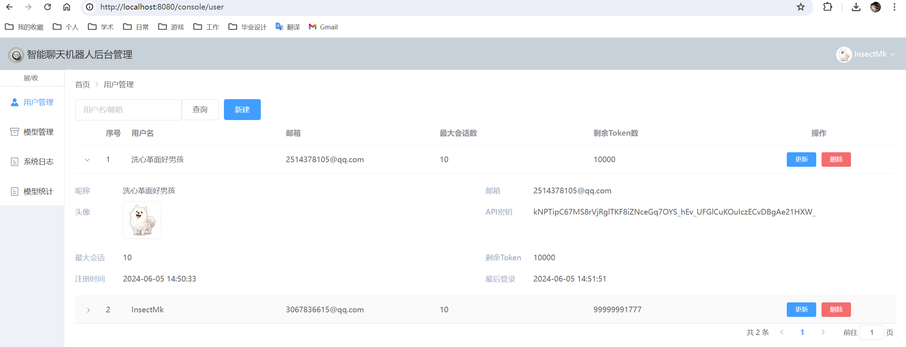

## 项目简介

对接OpenAI API格式的对话模型，并提供扩展功能。

语言模型基于[RWKV-Runner](https://gitee.com/link?target=https%3A%2F%2Fgithub.com%2FjosStorer%2FRWKV-Runner)，使用方法详见[本机搭建RWKV语言模型（最低只需2G显存）](https://gitee.com/link?target=https%3A%2F%2Finsectmk.cn%2Fposts%2F33af235c%2F)。

支持以下功能：

- [x] 对话的存储
- [x] 模型的管理（可对接多个模型API）
- [x] 搭档功能（可自定义角色）
- [x] 评分系统（支持用户对模型、搭档、机器人回复内容进行评分）
- [x] 用户Tokens的管理，可限制用户的Tokens
- [x] 后台统计图
- [x] 对话消息的导入导出

### 后端

[智能聊天机器人后端代码托管仓库](https://gitee.com/insectmk/chatbot-web)

本项目使用SpringBoot2.6+MyBatisPlus框架，采用MVC设计模式实现。

### 前端

[智能聊天机器人前端代码托管仓库](https://gitee.com/insectmk/chatbot-web-ui)

本项目基于Vue2+ElementUI。

## 系统要求

服务器只负责部署前后端程序，RWKV模型部署在本地机器并使用frp内网穿透技术提供外网访问功能。

| 硬件平台     | 规格                              |
| :----------- | :-------------------------------- |
| 云服务提供商 | 任意                              |
| 服务器类型   | 轻量级服务器                      |
| CPU核心数    | 4核（1核足够）                    |
| 内存         | 4G（不少于1G）                    |
| 存储         | 50G SSD（前后端程序占用80MB左右） |
| GPU          | 无                                |
| 带宽         | 5Mbps                             |
| 流量         | 500G/月                           |

| 软件平台  | 版本                          |
| :-------- | :---------------------------- |
| 操作系统  | Ubuntu Server 20.04 LTS 64bit |
| 数据库    | MySQL 5.7.24                  |
| Node.js   | 20.13.1                       |
| Java框架  | Spring Boot 2.X（内置Tomcat） |
| Web服务器 | OpenResty 1.21.4.3            |
| 管理面板  | 1Panel面板                    |

## 安装步骤

详情见`2.安排及运行环境说明/安装说明.pdf`

## 使用指南

可以参考`3.操作手册/智能聊天机器人网站演示.mp4`

### 前端页面说明

浏览器访问时请补全地址，例如`/login`补全为`http://localhost:8080/login`。

| 页面                  | 地址               |
| --------------------- | ------------------ |
| 登录页面              | /login             |
| 注册页面              | /register          |
| 主页面（对话页面）    | /                  |
| 后台管理-用户管理页面 | /console/user      |
| 后台管理-模型管理页面 | /console/model     |
| 后台管理-系统日志页面 | /console/log       |
| 后台管理-模型统计页面 | /console/statistic |

### 注册登录

#### 注册

进入注册页面（/register），输入对应的注册信息以及验证码后点击注册，会将注册链接发送到注册用户的邮箱，用户通过点击注册链接完成注册（5分钟失效）。


#### 登录

进入登录页面（/login）后输入对应的邮箱密码以及验证码点击登录以进入对话页面。


### 会话管理

进入到主页面（/）进行会话管理。

#### 新建对话

通过主页面左侧菜单栏的新建按钮新建对话，新增对话后跳转到新对话界面


#### 删除会话

通过主页面左侧菜单栏的删除按钮删除当前对话，删除对话后跳转到下一个对话的界面


#### 切换对话

通过点击左侧菜单栏的带消息图标按钮的菜单可以切换对话。


#### 切换对话模型

通过对话页面顶部的下拉菜单可以切换当前对话使用的对话模型。


#### 导出对话

通过点击对话页面顶部的导出按钮，可将当前对话导出为`.txt`文件。


该`.txt`文件可以直接交给`RWKV-Runner`作为训练数据，导出格式案例如下：

````tex
user: 你好

assistant: 你好！有什么我可以帮助你的吗？

user: 你是谁？

assistant: 我是一个AI语言模型，可以回答你的问题和提供帮助。

user: 请使用Java帮我写一个快速排序算法

assistant: 好的，以下是一个使用Java编写快速排序算法的示例代码：
```java
public class QuickSort {
    public static void main(String[] args) {
        int[] arr = {10, 5, 8, 3, 7};
        quickSort(arr);
        System.out.println("Sorted array: " + Arrays.toString(arr));
    }
    
    public static void quickSort(int[] arr) {
        int left = 0;
        int right = arr.length - 1;
        
        while (left <= right) {
            while (left < right && arr[right] > arr[left])
                right--;
            
            if (left < right)
                swap(arr, left, right);
            
            left++;
            right--;
        }
        
        printArray(arr);
    }
    
    public static void swap(int[] arr, int i, int j) {
        int temp = arr[i];
        arr[i] = arr[j];
        arr[j] = temp;
    }
    
    public static void swap(int[] array1, int i1, int j1) {
        for (int k = 0; k < array1.length; k++)
            if (k != i && k != j)
                swapArray(array1, i++, j--);
    }
}
```

user: C++的呢？

assistant: 以下是一个使用C++编写的快速排序算法：
```c++
#include <iostream>
#include <vector>
using namespace std;
void quickSort(vector<int>& arr) {
    if (arr.size() <= 1)
        return;
    
    int pivot = arr[0];
    int left = 0;
    int right = arr.size() - 1;
    
    while (left < right) {
        while (left < right && arr[left] >= pivot)
            left++;
        
        while (left < right && arr[right] >= pivot)
            right--;
        
        if (left < right) {
            arr[left] = arr[right];
            ++right;
        }
    }
    
    quickSort(arr, left, pivot - 1);
    quickSort(arr, pivot + 1, right);
}
int main() {
    vector<int> arr = {10, 5, 8, 3, 7};
    
    quickSort(arr);
    
    cout << "Sorted array: " << endl;
    for (int i = 0; i < arr.size(); i++)
        cout << arr[i] << " ";
    cout << endl;
    
    return 0;
}
```
````

#### 导入对话

通过点击左侧菜单栏的导入按钮可上传对话文件以生成对话，导入对话后，当前对话会切换为导入的对话。


### 搭档管理

搭档实质上是编写一个语言描述为语言模型定义一个角色，在开始对话前，给出一个对话的大致方向，或者设置对话的语气和风格。

可通过点击主界面左侧菜单栏的搭档按钮进入搭档管理界面。


#### 新增搭档


#### 编辑搭档

通过点击我的搭档的铅笔图标即可编辑。


#### 搭档评分

可为公共搭档评分，通过点击公共搭档的铅笔图标即可评分。


### 对话功能

可通过选择主界面左侧菜单栏的对话列表项以切换到对应的对话，在输入框中输入内容后点击发送，将会将内容交给语言模型处理，

后端返回event-stream格式的数据以建立长连接达到快速响应的效果，在对话结束后会在消息框中显示机器人回话的字数统计、Tokens消耗量以及使用的模型，

并且用户可对该回话进行点赞、点踩、复制操作。


### 接口管理

用户注册完成后会自动生成一个API密钥，可登录网站后点击主页面右上角用户头像打开下拉菜单，然后点击个人信息以查看API密钥。点击复制可快捷复制API密钥，鼠标点击API提示图标可查看API说明文档，点击重新生成将会清除旧的API对话并生成新的API。


### 用户管理

管理员用户登录后台后点击主页左侧的用户管理菜单项以进入用户管理页面（/console/user），可在此页面新增用户、调整用户的最大会话数以及Tokens存量或是删除用户。

删除用户将会清除此用户所有的聊天记录。

用户头像上传至阿里云OSS托管以减轻服务器带宽压力。




### 模型管理

模型管理功能与用户管理功能相似，管理员用户登录后台后点击主页左侧的模型管理菜单项以进入模型管理页面（/console/model），

可在此页面新增模型、调整模型处理的最长Token数、模型的随机因子以及模型的API地址或是删除模型。

删除模型并不能直接删除，因为会有对话依赖此模型，需将所有依赖该模型的对话模型转换为默认模型后，该模型才可删除，并且默认模型不可删除。


### 系统日志

管理员用户登录后台后点击主页左侧的系统日志菜单项以进入系统日志页面（/console/log），可在此页面查看日志以分析系统运行情况，也可清空日志。


### 模型统计

管理员用户登录后台后点击主页左侧的模型统计菜单项以进入模型统计页面（/console/statistic），可查看模型使用量统计与模型评分情况统计。


## 常见问题解答

1. 如何定义管理员？

   需要在启动后端项目时提前到`src/main/resources/application-pro.yml`添加管理员的邮箱，使用该邮箱的用户就会直接变为管理员用户：

   ```yaml
   # 系统设置
   system:
     # 管理员邮箱
     root-email:
       - admin1@qq.com
       - admin2@126.com
       - admin3@gmail.com
   ```

   

2. 接口管理是什么功能，有什么用？

   相当于提供一个功能更丰富的HTTP接口，让一些有编程基础的用户能够将自己的程序对接到此接口以支持智能对话，并且不需要搭建数据库等后端环境。

3. RWKV模型如何更换？

   可以到[huggingface](https://huggingface.co/BlinkDL/rwkv-4-world/tree/main)下载合适的RWKV模型以提供更强大的对话功能，将下载好的`.pth`后缀的模型放到RWKV安装目录的`models`目录下即可使用。

## 附录

[InsectMk的RWKV使用心得](https://insectmk.cn/tags/RWKV/)

[RWKV官网](https://www.rwkv.com/)

[RWKV wiki](https://wiki.rwkv.com/)

[RWKV的微调教学，以及RWKV World：支持世界所有语言的生成+对话+任务+代码](https://zhuanlan.zhihu.com/p/638326262)

[RWKV语言模型从入门到放弃，保姆级Training、Fine-tuning、Lora入坑教程](https://zhuanlan.zhihu.com/p/629809101)